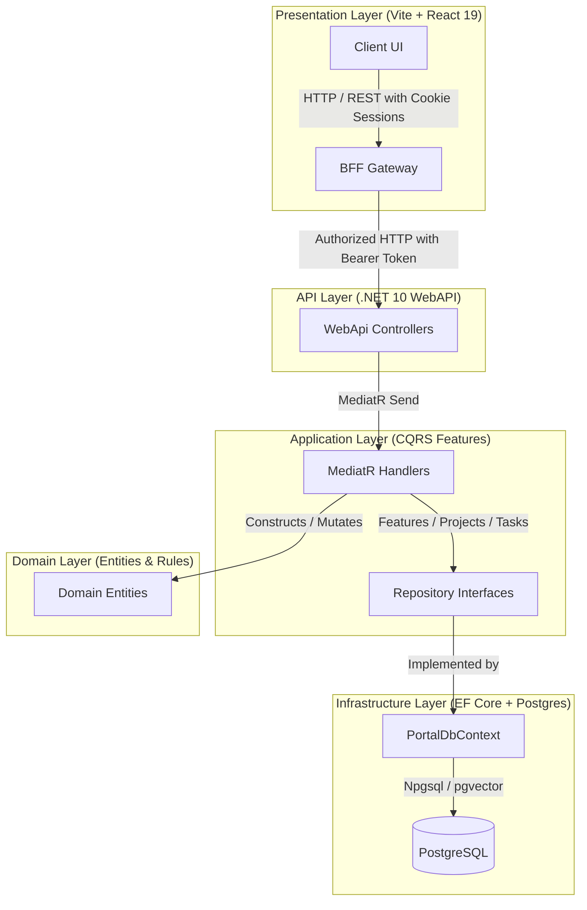

# Sagacity Solutions Portal: Enterprise Clean Architecture & Multi-Tenant SaaS Portal

[](#technology-stack)
[](#testing-architecture)
[](#system-architecture)

This repository is a production-grade, highly secure portfolio showcase of a modern, multi-tenant SaaS portal. It utilizes a **React 19 + TypeScript + Vite** frontend alongside a **.NET 10 Web API** designed using **Clean Architecture, CQRS (MediatR), and Entity Framework Core with PostgreSQL**.

---

## 1. System Architecture

The project is structured according to **Clean Architecture** and **Domain-Driven Design (DDD)** principles, separating concerns into strictly decoupled layers to ensure maximum maintainability, scalability, and testability.



### Decoupled Projects Breakdown

*   **sagacitysolutions.com.portal.Client**: Single-Page Application (SPA) built with **React 19, TypeScript, and Vite**, unit-tested with **Vitest**, and end-to-end browser-tested with **Playwright**.
*   **sagacitysolutions.com.portal.Bff**: Node.js/Express Backend-for-Frontend gateway serving the client, securing authorization tokens, and proxying Web API requests downstream.
*   **sagacitysolutions.com.portal.WebApi**: REST API endpoints, routing, policy-based authorization, and controller definitions.
*   **sagacitysolutions.com.portal.Application**: Core business use cases organizing features into vertical CQRS slices (MediatR Command/Query handlers), repository interfaces, and cross-cutting Pipeline Behaviors.
*   **sagacitysolutions.com.portal.Domain**: Pure domain model containing entities (`Project`, `WorkTask`, `Attachment`, `TaskLink`), value objects, custom exceptions, and domain events, free of external framework dependencies.
*   **sagacitysolutions.com.portal.Infrastructure**: Data access logic implementing EF Core `PortalDbContext`, repository implementations, database migrations, and PostgreSQL optimizations.

---

## 2. Technical Design Highlights

### A. CQRS & MediatR Feature Slices
The Application layer groups operations by functional feature set (Vertical Slices) rather than sprawling service classes. Each request is mapped to a distinct Command/Query and handled by a single-responsibility Handler:

```csharp
// Example request schema using C# Record Types
public record AddProjectRequest(string TenantId, string Name) : ICommand<Project>;

// Decoupled, single-responsibility handler
public class AddProjectHandler : IRequestHandler<AddProjectRequest, Project>
{
    private readonly IWriteRepository<Project> _repository;

    public AddProjectHandler(IWriteRepository<Project> repository)
    {
        _repository = repository ?? throw new ArgumentNullException(nameof(repository));
    }

    public async Task<Project> Handle(AddProjectRequest request, CancellationToken cancellationToken)
    {
        // Domain validation & creation
        var project = new Project(request.TenantId, request.Name);
        
        await _repository.AddAsync(project, cancellationToken);
        await _repository.SaveChangesAsync(cancellationToken);
        
        return project;
    }
}
```

### B. Logical Multi-Tenancy via EF Core Query Filters
The portal enforces tenant-level data isolation at the database layer. Global query filters automatically intercept EF Core queries and scope results dynamically based on claims extracted from the active request context:

```csharp
// Inside OnModelCreating:
modelBuilder.Entity<Project>(entity =>
{
    // Global query filter guarantees queries only pull authorized tenant data
    entity.HasQueryFilter(e => _authorizedTenantIds.Contains(e.TenantId));
    
    // Optimistic concurrency control using row versioning
    entity.Property(e => e.Version).IsRowVersion();
});
```
*   **Request Isolation:** The `_authorizedTenantIds` array is populated during request lifecycle initialization by extracting tenant claims from the authorized user's JWT.

### C. Primary Key Index Performance (Sequential GUIDs)
To prevent B-Tree primary key index fragmentation inside PostgreSQL (which standard random GUIDs trigger during heavy inserts), entity IDs are generated sequentially on the database server during insert operations:

```csharp
entity.Property(e => e.Id)
      .ValueGeneratedOnAdd()
      .HasValueGenerator<NpgsqlSequentialGuidValueGenerator>();
```
*   **Performance Impact:** Using sequential GUIDs guarantees that new records are inserted sequentially into index leaf pages, minimizing page splits and keeping write throughput consistent.

### D. BFF (Backend-for-Frontend) Token Gateway Security
In modern web applications, storing JWT tokens in browser LocalStorage or SessionStorage exposes them to Cross-Site Scripting (XSS) attacks. To resolve this, this portal uses the **BFF Security Pattern**:

1.  **HttpOnly, Secure Cookies:** The client web portal communicates with the Express BFF using standard cookie-based sessions (`SameSite=Lax`, `HttpOnly`, `Secure`). The actual JWT/AccessToken is never exposed to client-side JavaScript.
2.  **Downstream Proxying:** When the client sends requests to `/api/*`, the BFF intercepts the request, retrieves the access token from the secure session store, attaches it as a Bearer header (`Authorization: Bearer <token>`), and proxies the call to the downstream Web API:

```javascript
app.all("/api/*", async (req, res) => {
  const client = getLogtoClient(req.session, res);
  if (!(await client.isAuthenticated())) {
    return res.status(401).json({ error: "Not authenticated" });
  }

  try {
    const token = await client.getAccessToken(PORTAL_API);
    const headers = { Authorization: `Bearer ${token}` };
    
    const downstreamRequest = new Request(`${PORTAL_API}${req.path}`, {
      method: req.method,
      headers: { ...headers, ...req.headers },
      body: req.method === "GET" ? undefined : JSON.stringify(req.body),
    });

    const response = await fetch(downstreamRequest);
    // Pipe response status and data back to client...
  } catch (error) {
    res.status(502).json({ error: "Bad Gateway" });
  }
});
```

---

## 3. Testing Architecture

The codebase enforces a rigorous, multi-layered testing strategy across both client and server:

```
┌──────────────────────────────────────────────────────────────────────────────────┐
│                                TESTING ECOSYSTEM                                 │
└──────────────────────────────────────────────────────────────────────────────────┘
   1. Client Unit Tests (Vitest)          2. API Integration Tests (xUnit + Docker)
      - Fast component testing               - Testcontainers.PostgreSql database
      - Mocked client router                 - Respawn database state cleaner
   3. End-to-End Tests (Playwright)       4. Local Environment Orchestration
      - Browser automation                   - Multi-container Docker Compose
```

### Key Testing Implementations
*   **Database Integration Testing**:
    *   Uses **Testcontainers** to spin up an isolated, lightweight `postgres:14-alpine` Docker container for the duration of the test suite.
    *   Applies migrations dynamically on startup (`db.Database.MigrateAsync()`).
    *   Uses **Respawn** to perform extremely fast table truncation resets between individual test runs, avoiding the overhead of re-creating the database.
*   **Web API Testing**:
    *   Utilizes a custom `WebApplicationFactory` to mock OIDC endpoints and inject authentication handlers, letting tests verify routing, request mapping, and application behavior under different scopes and claims.
*   **End-to-End Browser Automation**:
    *   Playwright drives true multi-browser validation (Chromium, Firefox, WebKit) simulating actual login actions, project creation, and tenant validation flows.

---

## 4. Getting Started

### Prerequisites
*   [.NET 10 SDK](https://dotnet.microsoft.com/download)
*   [Node.js](https://nodejs.org/) (V18+)
*   [Docker & Docker Compose](https://www.docker.com/)

### Step-by-Step Running Guide

1.  **Clone and Spin Up Infrastructure:**
    Launch the Postgres database container and local OIDC Server:
    ```bash
    docker-compose up -d
    ```

2.  **Apply EF Core Migrations:**
    Build and apply database changes:
    ```bash
    cd src/sagacitysolutions.com.portal.Infrastructure
    dotnet ef database update --startup-project ../sagacitysolutions.com.portal.WebApi
    ```

3.  **Run the Web API and BFF Gateway:**
    *   Start the .NET Web API:
        ```bash
        cd src/sagacitysolutions.com.portal.WebApi
        dotnet run
        ```
    *   Start the BFF Gateway:
        ```bash
        cd src/sagacitysolutions.com.portal.Bff
        npm install
        npm start
        ```

4.  **Run the Frontend Portal Client:**
    ```bash
    cd src/sagacitysolutions.com.portal.Client
    npm install
    npm run dev
    ```
    Access the portal client at `http://localhost:5173`.

---

## 5. Running the Test Suites

To execute integration, unit, and end-to-end tests:

*   **Run Server Integration Tests:**
    ```bash
    dotnet test
    ```
*   **Run Frontend Unit Tests:**
    ```bash
    cd src/sagacitysolutions.com.portal.Client
    npm run test
    ```
*   **Run End-to-End Tests:**
    ```bash
    cd src/sagacitysolutions.com.portal.Client
    npx playwright test
    ```
